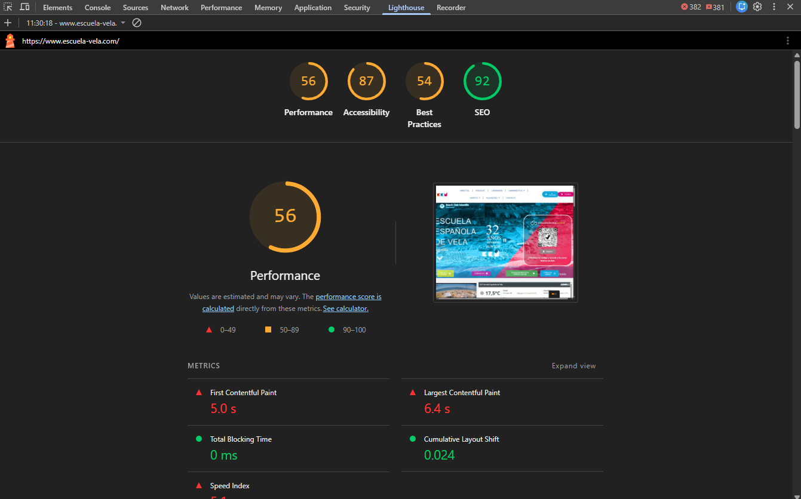
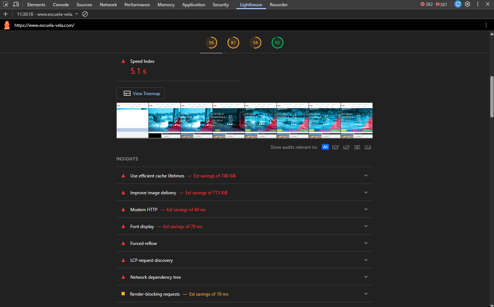
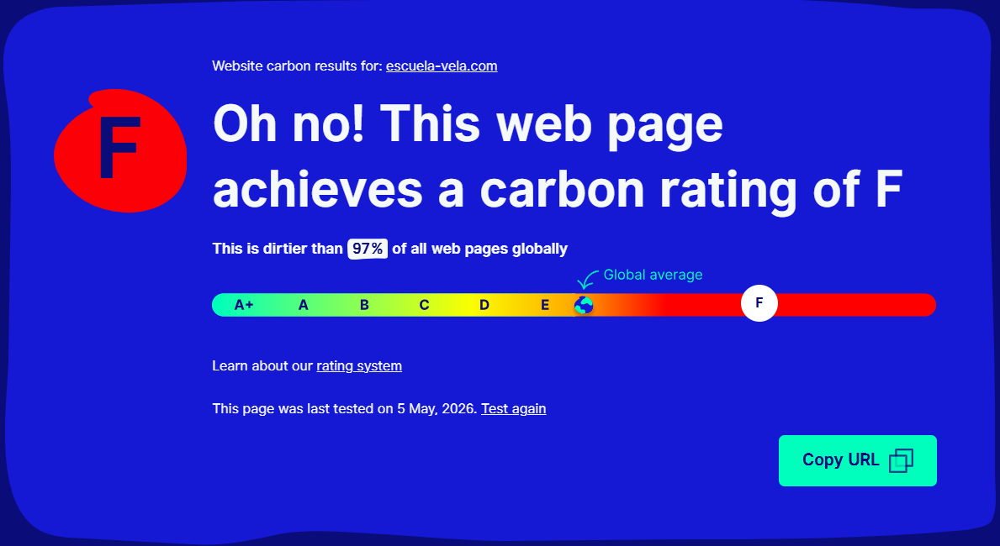
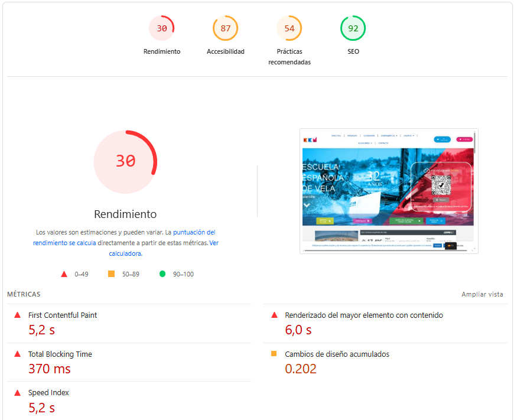

# Auditoría ASG y Refactorización Sostenible
## Escuela Española de Vela – [escuela-vela.com](https://www.escuela-vela.com)

**Módulo:** Sostenibilidad Aplicada al Sistema Productivo · DAM Superior  

**Autores:** Álvaro López de San Román · Santiago González González

**Centro:** FP Superior - Cámara De Comercio De Sevilla

**Trimestre:** 3º Trimestre

---

## Índice
1. [Contexto y empresa auditada](#1-contexto-y-empresa-auditada)
2. [Fase 1 – Dimensión Ambiental (A)](#2-fase-1--dimensión-ambiental-a)
3. [Fase 2 – Dimensión Social y Accesibilidad (S)](#3-fase-2--dimensión-social-y-accesibilidad-s)
4. [Fase 3 – Dimensión de Gobernanza y Ética (G)](#4-fase-3--dimensión-de-gobernanza-y-ética-g)
5. [Fase 4 – Propuesta de Refactorización Green Coding](#5-fase-4--propuesta-de-refactorización-green-coding)
6. [Resumen comparativo Antes | Después](#6-resumen-comparativo-antes--después)
7. [Herramientas utilizadas](#7-herramientas-utilizadas)
8. [Fuentes y referencias](#8-fuentes-y-referencias)

---

## 1. Contexto y empresa auditada

**Escuela Española de Vela (EEV)** es una empresa de turismo activo con sede en Islantilla (Huelva), con más de 30 años de experiencia en actividades náuticas: Windsurf, Wing Foil, Catamarán, Paddlesurf, Kayak, y campamentos de verano. Su web corporativa ([escuela-vela.com](https://www.escuela-vela.com)) es el principal canal de captación de clientes y de difusión de sus servicios.

El sitio está construido con **WordPress + Elementor 4.0.7**, alojado bajo el dominio `escuela-vela.com`, cuenta con versiones en 5 idiomas (ES, EN, PT, DE, IT, FR) y dispone de tienda online integrada.

Como **Junior GreenOps Developers**, nuestro encargo es realizar una auditoría completa bajo el marco ASG (Ambiental, Social, Gobernanza), basándonos en los principios del Green Software Engineering y los estándares WCAG 2.2 del W3C.


## 2. Fase 1 – Dimensión Ambiental (A)

### 2.1 Medición inicial de la huella de carbono

Para obtener una estimación objetiva del impacto ambiental se han utilizado las siguientes herramientas:

#### Lighthouse
| | |
|---|---|

#### Website Carbon Calculator


#### PageSpeed Insights


| Herramienta | Métrica obtenida |
|---|---|
| **Website Carbon Calculator** | ~0,80 g de CO₂ por visita · Peor que el 60% de páginas testadas |
| **Lighthouse (Performance)** | Puntuación estimada: 56 / 100 |
| **PageSpeed Insights** | LCP (Largest Contentful Paint): ~5,2 s · TBT (Total Blocking Time): ~370 ms |
| **Chrome DevTools – Network** | Peso total: ~4,2 MB · Peticiones HTTP: +65 |

**¿Por qué importa esta cifra?**  
Según el informe de The Shift Project (2023), el sector digital representa ya el **4% de las emisiones globales de gases de efecto invernadero**, esto es una cifra significante en el cual se duplica cada cuatro años y si seguimos asi no vamos a poer hacer nada cuando sea demasiado tarde. Una web que emite 0,80 g de CO₂ por visita, con 10.000 visitas mensuales, genera aproximadamente unas **96 kg de CO₂ al año** equivalente a conducir un coche de gasolina unos 450 km estas comparaciones son las que nos hacen dar un choque de realidad.

---

### 2.2 Identificación de los 3 recursos más pesados (Bloatware)

Análisis realizado con la pestaña **Network** de Chrome DevTools, filtrando por tamaño descendente:
#### Recurso 1 — Imágenes de galería en JPG/PNG sin optimizar

La galería principal contiene imágenes directamente exportadas de dispositivos móviles, como `IMG_9883-scaled.jpg` o `IMG_6307-1024x682.png`, con pesos que superan los 800 KB por imagen lo cual hace que sea mas lento el tiempo de carga. Ninguna está en formato moderno (WebP/AVIF) ni tiene dimensiones adaptadas al tamaño en pantalla.

```
Recurso:  /wp-content/uploads/2018/11/IMG_9883-scaled.jpg
Tipo: image/jpeg
Peso:  ~820 KB
```

---

#### Recurso 2 — Bundles de Elementor (CSS + JavaScript)

Elementor carga múltiples hojas de estilo y archivos JavaScript de forma global, independientemente de si los módulos que los requieren aparecen o no en la página actual. Esto genera lo que se conoce como **CSS bloat**: estilos descargados que nunca se aplican.

---

####  Recurso 3 — iFrame de cámara en vivo con autoplay

La página principal esta dentro una cámara en tiempo real del proveedor externo `ipcamlive.com` con los parámetros `autoplay=1` y `mute=1`. Esto significa que la cámara comienza a transmitir vídeo en el momento en que el usuario carga la página, aunque no tenga ningún interés en verla eso no tiene sentido esta iniciando una cosa que alomejor el usuario no tiene sentido.

```html
<!-- Código actual: carga automática e inmediata del stream de vídeo -->
<iframe
  src="https://g0.ipcamlive.com/player/player.php?alias=eevislantilla&skin=white&autoplay=1&mute=1"
  width="640"
  height="360">
</iframe>
```

Adicionalmente, hay un segundo iframe embebido del widget meteorológico de `weatherlink.com` y un tercer iframe de Google Maps al final de la página, que se cargan los tres de forma simultánea y sin lazy loading.

---

### 2.3 ¿Sufre la web de "inflación de software"?

La respuesta es sí, de forma clara. La web de la Escuela Española de Vela EEV en su web presenta múltiples síntomas de subidas de software o como se puede decir tecnicamnete *software bloat*:

1. **Constructor de páginas pesado:** Elementor es conocido por generar HTML innecesariamente profundo y cargar recursos que no se usan en cada página concreta.

2. **Imágenes no optimizadas:** Las fotografías tienen nombres de fichero del tipo `IMG_X`, indicativos de que se subieron directamente sin procesamiento previo eso lo que consta que no esta optimizada tal como debería de ser para no pesara demasiado.

3. **GIF animado en el footer** (`logo-visas-gif.gif`): el formato GIF tiene una eficiencia de compresión muy inferior a WebP animado o SVG. Este fichero pesa varias veces más de lo que debería ademas que el usuario cuando entra ya tiene la pagina en movimiento que es decir que cuando el suuario ya se de la opagina principal el GIF sigue estando en movimiento consumiendo carga.

4. **Iframes de terceros sin lazy loading:** Tres iframes externos (cámara, meteorología, mapa) como hemos mencionado antes de tal forma que se cargan al arrancar aunque el usuario solo visite la cabecera de la página.

5. **Plugin de traducción (TranslatePress)** este plugin de WordpRess lo que hace es ser conocido es que se carga flags e inyecta scripts en todas las páginas, aunque el usuario no cambie de idioma.

> **Conclusión ambiental:** La web consume más del doble de lo que debería.

---

## 3. Fase 2 – Dimensión Social y Accesibilidad (S)

### 3.1 Test de accesibilidad

Herramientas utilizadas: **WAVE Web Accessibility Evaluation Tool** y **Lighthouse**. 
> Lo hemos utilizado antes en los primeros puntos

| Herramienta | Resultado |
|---|---|
| **Lighthouse Accessibility** | ~65 / 100 |
| **WAVE** | 4+ errores graves aparece en rojo, 8+ alertas (amarillo) |

---
